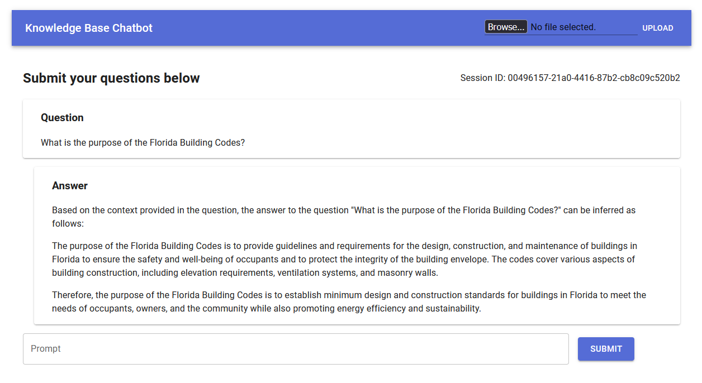

# Knowledge Base Chatbot Using Ollama Models

This version is based off: https://github.com/Jaxnode-UG/jaxnodelangchain utilizing many of the example methods to interface with Ollama using Langchain, but expanding on it by setting up a Node JS Express API and a Vite React Front end interface to interact with the models and documents easier.

**See it in action:**



**Note:** _The processing of very large documents is currently a time consuming step, uploading a plain text document with 60k lines took roughly 23 minutes to process on a machine running an RTX 3080ti and a Ryzen 9 5900x._ It would be easier to manually add documents to the raw folder and running on the terminal `npm run batch-process-documents` or simply uploading large documents at night to leave the system running for a few hours. After the documents are processed the questions about the document will happen much faster, but that also depends on the Ollama model you have chosen to use.

## External Requirements & Dependencies

1. Running Version of Ollama, please see: [ollama.com](https://ollama.com/)
2. Node JS, please see: [NodeJS.org](https://nodejs.org)
3. Docker Desktop or a PostgresQL Database, please see [docker.com](https://www.docker.com/) or [postgresql.org](https://postgresql.org)

## Set-Up

- create a `.env`` file at the root of the project directory and add the following contents to it (Ensure to replace connection information to match your postgres server):

```env
PG_HOST=localhost
PG_PORT=5432
PG_USER=postgres
PG_PWD=password
PG_DATABASE=ollamavector
MODEL_NAME=llama2
MODEL_URL="http://localhost:11434"
PORT=8080
```

- Ensure to start the database using docker

```bash
docker run -d --name pgvector -e POSTGRES_PASSWORD=password -v ${HOME}/pgvector/:/var/lib/postgresql/data -p 5432:5432 pgvector/pgvector:pg16
```

Now that we have started a database server on our computer with Docker, we can log into the running container to create a database that we can use to store our vectors.

```bash
docker exec -it pgvector psql -U postgres
create database ollamavector;
# DATABASE CREATED
CREATE EXTENSION IF NOT EXISTS vector;
# EXTENSION vector CREATED
\q
```
